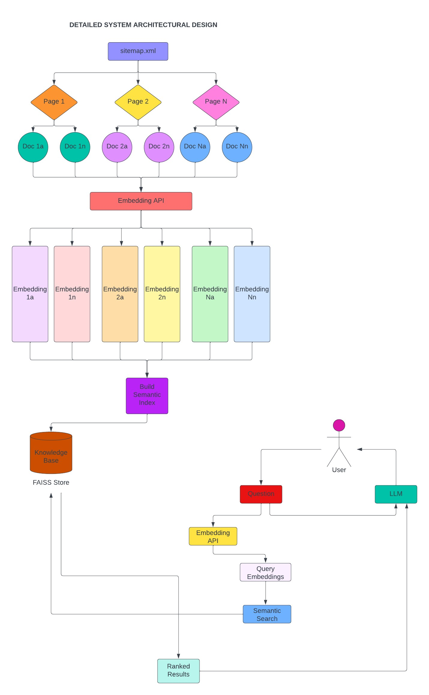
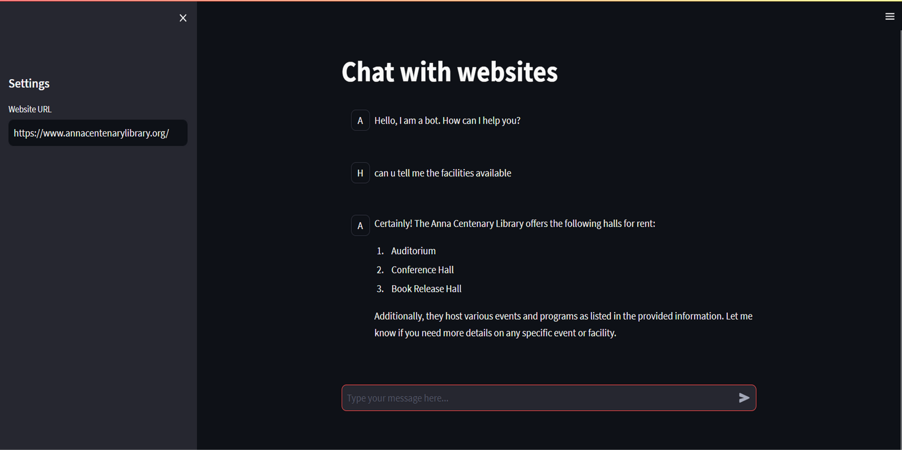

# Chatbot for Anna Centenary Library

This project develops a customized AI-driven chatbot for the Anna Centenary Library, enhancing user engagement through natural language processing. It provides 24/7 access to digital resources, automating routine tasks and answering common queries to support library staff. The chatbot modernizes user interaction, reinforcing the library's commitment to cultural and technological innovation.

## Features

- **24/7 User Support**: Always available for user assistance.
- **FAQ Handling**: Instantly answers common questions.
- **Resource Discovery**: Helps users find books, journals, and multimedia.
- **Personalized Recommendations**: Suggests materials based on user preferences.
- **Remote Access Support**: Provides access to digital collections from anywhere.
- **Event Promotion**: Shares info on library events and services.
- **Streamlit Interface**: Easy-to-use, intuitive design.
- **Advanced Models**: Powered by GPT-4 and other leading AI models.
- **Python-based**: Built entirely in Python for flexibility and customization.

## System Architecture



## Installation
Ensure you have Python installed on your system. Then clone this repository:

```bash
git clone [repository-link]
cd [repository-directory]
```

Install the required packages:

```bash
pip install -r requirements.txt
```

Create your own .env file with the following variables:

```bash
OPENAI_API_KEY=[your-openai-api-key]
```

## Usage
To run the Streamlit app:

```bash
streamlit run app.py
```

## Demo of the Application





